# LearnOpenGL2

再一次学习opengl，不一样的收获

克隆代码

```shell
git clone git@github.com:zwmain/LearnOpenGL2.git --recursive
```

glfw地址 [https://www.glfw.org/](https://www.glfw.org/)

glfw github地址 [https://github.com/glfw/glfw](https://github.com/glfw/glfw)

glad地址 [https://gen.glad.sh/](https://gen.glad.sh/)

坐标系工具 [https://www.geogebra.org](https://www.geogebra.org/classic?lang=zh_CN)

调色板工具 [https://www.sojson.com/web/panel.html](https://www.sojson.com/web/panel.html)

## 01.Triangle

从绘制一个简单的三角形开始，重点在于了解基础概念

先看一下几个名词

- 顶点缓冲对象：Vertex Buffer Object，VBO
- 顶点数组对象：Vertex Array Object，VAO
- 元素缓冲对象：Element Buffer Object，EBO 或 索引缓冲对象 Index Buffer Object，IBO

### 什么是VBO

顶点缓冲对象，Vertex Buffer Object，VBO，表示了在GPU显存上的一段存储空间对象。

```c++
std::vector<float> vertices = {
    -0.5f, -0.5f, 0.0f, // 左下角顶点
    0.5f, -0.5f, 0.0f,  // 右下角顶点
    0.0f, 0.5f, 0.0f    // 顶部顶点
};
```

我们在C++中准备的顶点，就会在GPU上的显存中放置，vbo就是用来在C++中管理数据的东西

vbo只是数据，只是buffer，任何可以描述成二进制的东西，都可以存到vbo中

后面我们还会往vbo中存储颜色、纹理、等其他数据

在C++中，我们对vbo的操作，需要通过一个`unsigned int`实现，这个变量就是vbo的唯一id，所有的操作都只能都过这个id进行

### VBO的操作方法

#### VBO的创建与销毁

```c++
void glGenBuffers(GLsizei n, GLuint* buffers)
```

- n: 创建多少个vbo
- buffers: 创建出来的vbo id列表的首地址

比如只创建一个vbo：

```c++
unsigned int VBO = 0;
glGenBuffers(1, &VBO);
```

如果需要创建很多个vbo，可以这样写：

```c++
std::vector<unsigned int> vboArr(5); // 5个vbo数组
glGenBuffers(vboArr.size(), vboArr.data()); // 将数组首地址传递给接口
```

VBO的销毁，接口和创建一样，理解了创建vbo，销毁就没什么好说的

```c++
void glDeleteBuffers(GLsizei n, GLuint * buffers)
```

#### VBO绑定与数据传输

了解过opengl的，或多或少都了解opengl是一个状态机

同时opengl状态机里只能存在一个vbo，也就是有个当前vbo，需要根据需求，将新的vbo绑定到当前vbo上

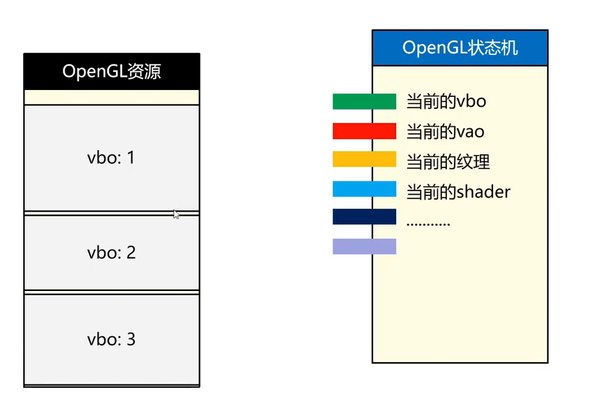

因此也就有了绑定，也就是我们手动将vbo id设置为当前的vbo

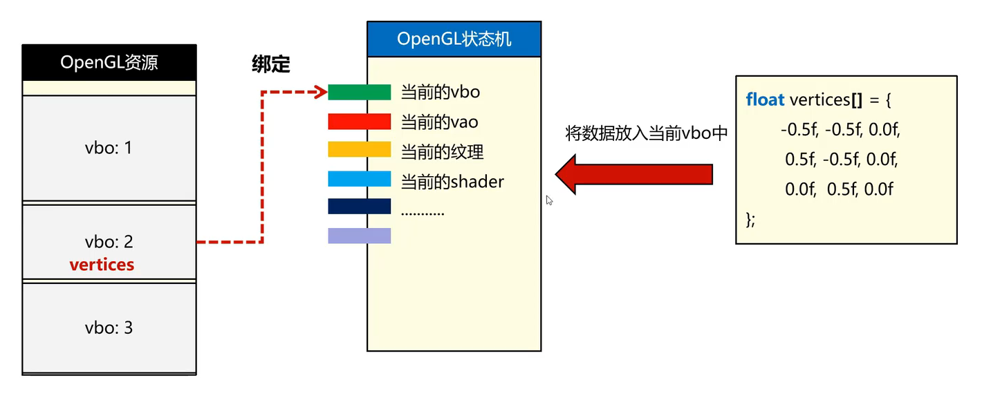

绑定接口为：

```c++
void glBindBuffer(GLenum target, GLuint buffer);
```

- target: 把vbo绑定到哪个插槽，一般为`GL_ARRAY_BUFFER`，其他详细信息问AI
- buffer: vbo的id，也就是`glGenBuffers`创建出来的东西

vbo数据填充接口：

```c++
void glBufferData(GLenum target, GLsizeiptr size, const void * data, GLenum usage)
```

- target: 针对状态机的哪个插槽的buffer，这个要和bind时的target一致
- size: buffer的数据大小，单位为字节
- data: 数据的首地址指针
- usage: 当前buffer的用法，有两个选项
  - GL_STATIC_DRAW: vbo数据不会频繁改变
  - GL_DYNAMIC_DRAW: vbo数据会频繁改变

`glBufferData`才会为gpu真正的开辟显存，存入数据

如果绑定完，操作完，想要取消绑定，直接绑定0就行

在实际使用vbo时，就像下面代码这样。准备原始数据、创建vbo id、绑定vbo到状态机、将数据传递到gpu上对应vbo id的显存上。

```c++
std::vector<float> vertices = {
    -0.5f, -0.5f, 0.0f, // 左下角顶点
    0.5f, -0.5f, 0.0f,  // 右下角顶点
    0.0f, 0.5f, 0.0f    // 顶部顶点
};
glGenBuffers(1, &VBO);
glBindBuffer(GL_ARRAY_BUFFER, VBO);
glBufferData(GL_ARRAY_BUFFER, vertices.size() * sizeof(float), vertices.data(), GL_STATIC_DRAW);
```

多个vbo也一样处理，记得用哪个vbo就要绑定哪个vbo id，opengl同一时间只能存在一个vbo

### VBO与多属性存储

顶点除了有位置信息外，还有有颜色、纹理、法线等其他各种属性

以颜色为例，颜色数据长这样：

```c++
std::vector<float> colors = {
    1.0f, 0.0f, 0.0f, // 第一个顶点rgb
    0.0f, 1.0f, 0.0f, // 第二个顶点rgb
    0.0f, 0.0f, 1.0f  // 第三个顶点rgb
};
```

只看数据形式，这就是一个float数组，与顶点数据没有任何区别，因此也由vbo管理

既然也由vbo管理，那么就有不同的存储方式：

- 不同属性各自存储为一个vbo（single buffer）。顶点用一个vbo，颜色也用一个vbo
- 所有属性放在同一个vbo里面，交叉存储（interleaved buffer）

交叉存储就像下面这样：

```c++
std::vector<float> vertices = {
    -0.5f, -0.5f, 0.0f, 1.0f, 0.0f, 0.0f, // 第一个顶点的位置和颜色rgb
     0.5f, -0.5f, 0.0f, 0.0f, 1.0f, 0.0f, // 第二个顶点的位置和颜色rgb
     0.0f,  0.5f, 0.0f, 0.0f, 0.0f, 1.0f  // 第三个顶点的位置和颜色rgb
};
```

数据都存在了一起，那么显卡该怎么解析这坨数据呢

这时就需要VAO来描述这些数据了

### VAO解析

#### VAO的含义与作用

参考[bilibli视频教程](https://www.bilibili.com/video/BV1wC4y167gr?spm_id_from=333.788.videopod.sections&vd_source=253665670f58711b6090f7dd6968a8a2)

顶点数组对象，Vertex Array Object，VAO。存储一个图形的所有顶点的**描述**信息

给定一个三角形的三个顶点，这次我们没有做格式化，看起来就是一串浮点数据

在gpu眼里，这就是一串二进制数据，你不告诉gpu怎么解析这串数据的话，它是画不出三角形的

```txt
-0.5f, -0.5f, 0.0f, 0.5f, -0.5f, 0.0f, 0.0f, 0.5f, 0.0f
```

我们尝试描述一下这串数据：

- 每个顶点3个数字
- 每个数字都是float类型，也就是4个字节，xyz共同组成一个点，就要用12个字节
- 从一个顶点，跳到下一个顶点，要跳12字节，也就是步长是12个字节

上面只是简单情况，步长显得有点多余，因为已知顶点类型和数字数量，步长可以直接算出来

但是，一串数据可能包含了不只顶点位置数据，比如还有颜色属性

```c++
std::vector<float> vertices = {
    -0.5f, -0.5f, 0.0f, 1.0f, 0.0f, 0.0f, // 第一个顶点的位置和颜色rgb
     0.5f, -0.5f, 0.0f, 0.0f, 1.0f, 0.0f, // 第二个顶点的位置和颜色rgb
     0.0f,  0.5f, 0.0f, 0.0f, 0.0f, 1.0f  // 第三个顶点的位置和颜色rgb
};
```

此时，我们再尝试解析这个vbo

- 每个顶点有3个位置数据，紧接着有3个颜色数据
- 每个数据都是float类型，4字节，xyz+rgb共6个数字组成一个顶点，要用24字节
- 从一个顶点的**位置信息**跳到下一个顶点的位置信息，需要跳24字节；颜色信息，在一组顶点数据内部，还需要偏移12字节

因此，步长是非常重要的一个参数

再来看另外一种情况，顶点位置和颜色分开存储：

```c++
std::vector<float> vertices = {
    -0.5f, -0.5f, 0.0f, // 左下角顶点
    0.5f, -0.5f, 0.0f,  // 右下角顶点
    0.0f, 0.5f, 0.0f    // 顶部顶点
};
std::vector<float> colors = {
    1.0f, 0.0f, 0.0f, // 第一个顶点rgb
    0.0f, 1.0f, 0.0f, // 第二个顶点rgb
    0.0f, 0.0f, 1.0f  // 第三个顶点rgb
};
```

由于分开存储，各自有一个自己的vboId，那么vao在描述顶点属性的时候，就需要知道描述的是哪个vbo，就像下面这样。0号位置放的是位置，1号放的是颜色数据，2号放的是纹理等等

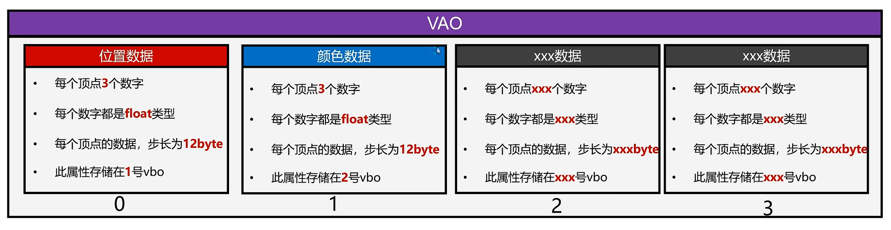

现在我们可以总结，对于三角形的某个属性，我们需要知道的描述信息为：

- 每个顶点xxx个数字
- 每个数字都是xxx类型
- 每个顶点的数据到下个顶点的数据步长为xxx字节
- 此属性数据在顶点数据内的偏移量
- 此属性存在xxx号vbo

就像下面这样

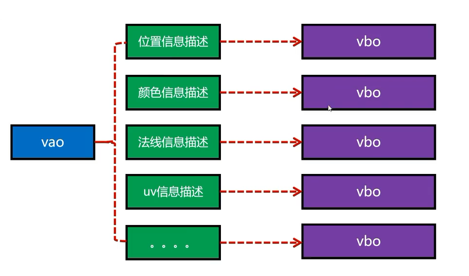

或者所有属性都放在一个vbo里

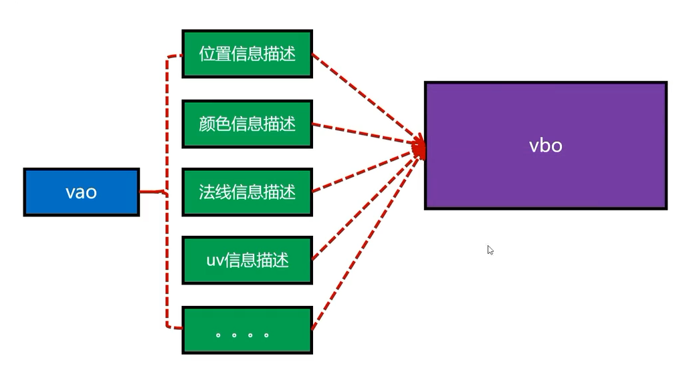


#### VAO的创建与删除

VAO的创建

```c++
void glGenVertexArrays(GLsizei n, GLuint* arrays);
```

- n: 创建多少个vao
- arrays: 创建出来的vao数组的首地址

VAO的删除

```c++
void glDeleteVertexArrays(GLsizei n, const GLuint* arrays);
```

- n: 删除多少个vao
- arrays: 要删除的vao数组的首地址

VAO的绑定

```c++
void glBindVertexArray(GLuint array);
```

- array: vao的编号，id

激活vao属性插槽

```c++
void glEnableVertexAttribArray(GLuint index);
```

- index: 激活哪个属性插槽，与`glVertexAttribPointer`的index参数对应

给vao加属性时，一定要先激活对应插槽


VAO加入属性描述，最重要

```c++
void glVertexAttribPointer(GLuint index, GLint size, GLenum type, GLboolean normalized, GLsizei stride, const void * pointer);
```

- index: 描述第几个属性
- size: 这个属性包含几个数字
- type: 这个属性是什么数据类型
- normalized: 是否归一化（一般用不到）
- stride: 每个顶点的数据步长
- pointer: 这个属性在每个顶点内的偏移量

看一下这些参数，似乎这里并没有指定vao的地方，那么该怎么告诉vao要用哪个vbo呢

opengl是个状态机，当前只有一个绑定的vbo，绑定的是哪个vbo，这个函数用的就是哪个vbo


顺便说一下用不到的`normalized`参数。仅对非浮点型数据类型（如 `GL_BYTE`、`GL_UNSIGNED_BYTE` 等）生效，用于控制整数数据在传递到顶点着色器前是否进行归一化处理。当 `normalized = GL_TRUE` 时，整数数据会被自动缩放到 `[-1.0, 1.0]`（有符号类型）或 `[0.0, 1.0]`（无符号类型） 的浮点范围；若为 `GL_FALSE`，则直接转换为浮点数而不归一化。对于浮点类型（如 `GL_FLOAT`），此参数无效。

#### VAO总结

一般情况下vao的使用流程如下，这里是有多个vbo的使用流程：

```c++
// 定义一个简单三角形的三个顶点位置
std::vector<float> vertices = {
    -0.5f, -0.5f, 0.0f, // 左下角顶点
    0.5f, -0.5f, 0.0f, // 右下角顶点
    0.0f, 0.5f, 0.0f // 顶部顶点
};
std::vector<float> colors = {
    1.0f, 0.0f, 0.0f, // 第一个顶点rgb
    0.0f, 1.0f, 0.0f, // 第二个顶点rgb
    0.0f, 0.0f, 1.0f // 第三个顶点rgb
};

unsigned int vertexVboId = 0;
// 创建 VBO（顶点缓冲对象）并上传顶点数据到 GPU
glGenBuffers(1, &vertexVboId);
glBindBuffer(GL_ARRAY_BUFFER, vertexVboId);
glBufferData(GL_ARRAY_BUFFER, vertices.size() * sizeof(float), vertices.data(), GL_STATIC_DRAW);
glBindBuffer(GL_ARRAY_BUFFER, 0); // 解绑顶点vbo，为其他vbo做准备

unsigned int colorVboId = 0;
// 创建另一个 VBO 用于颜色数据，并上传到 GPU
glGenBuffers(1, &colorVboId);
glBindBuffer(GL_ARRAY_BUFFER, colorVboId);
glBufferData(GL_ARRAY_BUFFER, colors.size() * sizeof(float), colors.data(), GL_STATIC_DRAW);
glBindBuffer(GL_ARRAY_BUFFER, 0); // 解绑颜色vbo，为其他vbo做准备

unsigned int vaoId = 0;
// 创建 VAO（顶点数组对象）并记录顶点属性配置
glGenVertexArrays(1, &vaoId);
// 由于vao描述了整个图形，后面的多个vbo都由vao描述，因此整个过程vao一直保持激活状态
glBindVertexArray(vaoId);

// 此时没有任何激活的vbo，因此后面每次添加描述的时候都要绑定对应的vbo

// 告诉 OpenGL 顶点数据的布局：位置属性在 location 0，3 个 float，紧密排列
glBindBuffer(GL_ARRAY_BUFFER, vertexVboId); // 绑定顶点vbo，描述才会效
glEnableVertexAttribArray(0); // 启用属性 location 0，顶点数据将会放置0位置
glVertexAttribPointer(0, 3, GL_FLOAT, GL_FALSE, 3 * sizeof(float),(void*)0);
glBindBuffer(GL_ARRAY_BUFFER, 0); // 顶点vbo已经描述完毕，解绑顶点vbo，为颜色vbo做准备，vao仍然保持激活状态

// 告诉 OpenGL 颜色数据的布局：颜色属性在 location 1，3 个 float，紧密排列
glBindBuffer(GL_ARRAY_BUFFER, colorVboId); // 绑定颜色vbo，描述才会生效
glEnableVertexAttribArray(1); // 启用属性 location 1，颜色数据将会放置到1位置
glVertexAttribPointer(1, 3, GL_FLOAT, GL_FALSE, 3 * sizeof(float), (void*)0);
glBindBuffer(GL_ARRAY_BUFFER, 0); // 颜色vbo已经描述完毕，解绑颜色vbo，vao仍然保持激活状态

// vbo以全部描述完毕，vao可以解绑了；解绑VAO，使状态不会意外影响后续操作
glBindVertexArray(0);

```

再看看交叉存储的vbo是如何配合vao使用的：

```c++
// 定义一个简单三角形的三个顶点位置和颜色属性
std::vector<float> vertices = {
    -0.5f, -0.5f, 0.0f, 1.0f, 0.0f, 0.0f, // 左下角顶点坐标和rgb
    0.5f, -0.5f, 0.0f, 0.0f, 1.0f, 0.0f, // 右下角顶点和rgb
    0.0f, 0.5f, 0.0f, 0.0f, 0.0f, 1.0f // 顶部顶点和rgb
};

unsigned int vertexVboId = 0;
// 创建 VBO（顶点缓冲对象）并上传顶点数据到 GPU
glGenBuffers(1, &vertexVboId);
glBindBuffer(GL_ARRAY_BUFFER, vertexVboId);
glBufferData(GL_ARRAY_BUFFER, vertices.size() * sizeof(float), vertices.data(), GL_STATIC_DRAW);
glBindBuffer(GL_ARRAY_BUFFER, 0); // 解绑顶点vbo，放置干扰其他vbo，不过这里只有这一个vbo

unsigned int vaoId = 0;
// 创建 VAO（顶点数组对象）并记录顶点属性配置
glGenVertexArrays(1, &vaoId);
// 由于vao描述了整个图形，后面的多个vbo都由vao描述，因此整个过程vao一直保持激活状态
glBindVertexArray(vaoId);


// 此时没有任何激活的vbo，因此后面每次添加描述的时候都要绑定对应的vbo

// 告诉 OpenGL 顶点数据的布局：位置属性在 location 0，3 个 float，紧密排列
// 颜色属性在每个顶点的第 3 个 float 之后，3 个 float，紧密排列
glBindBuffer(GL_ARRAY_BUFFER, vertexVboId); // 绑定vbo，描述才会生效
glEnableVertexAttribArray(0); // 启用属性 location 0，顶点数据将会放置到0位置
glVertexAttribPointer(0, 3, GL_FLOAT, GL_FALSE, 6 * sizeof(float), (void*)0); // 这里步长为6个float，偏移为0
// 这里直接开始描述第二个属性
glEnableVertexAttribArray(1); // 启用属性 location 1，颜色数据将会放置到1位置
// 这里步长为6个float，偏移为3个float（位置属性占用3个float）
glVertexAttribPointer(1, 3, GL_FLOAT, GL_FALSE, 6 * sizeof(float), reinterpret_cast<void*>(3 * sizeof(float)));
glBindBuffer(GL_ARRAY_BUFFER, 0); // 顶点vbo已经描述完毕，解绑顶点vbo，为颜色vbo做准备，vao仍然保持激活状态

// vbo以全部描述完毕，vao可以解绑了；解绑VAO，使状态不会意外影响后续操作
glBindVertexArray(0);

```

我们再来看看vao location和着色器之间的关系

直接上图，从图里可以看到，代码里的`glVertexAttribPointer` index参数就是顶点着色器里的location

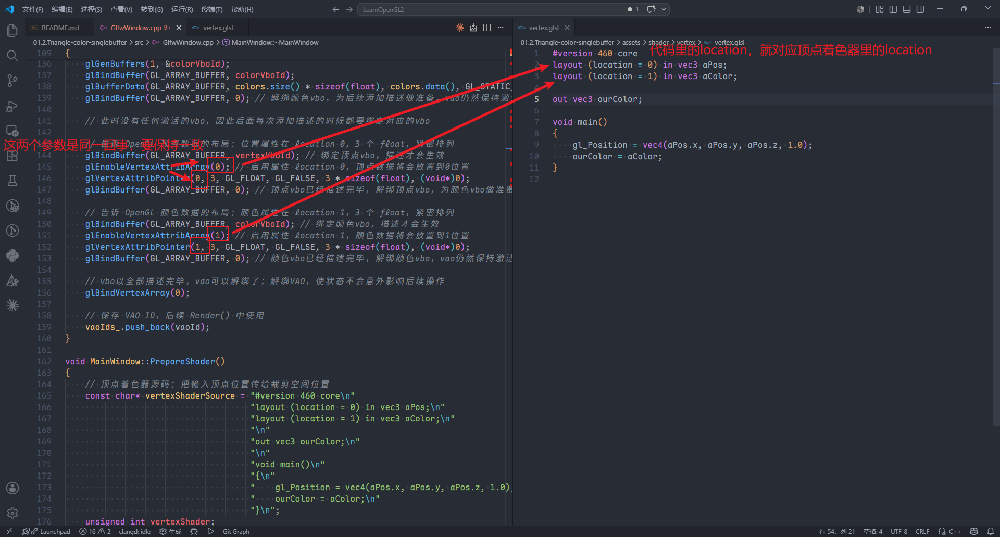


最后的最后，一定要记住，一个vao就可以完全代表一个图形，现在是一个三角形，后面会代表整个3D模型

### 着色器

着色器代表着材质，也就是材质。在 OpenGL 中，着色器是用 GLSL（OpenGL Shading Language）语言编写的程序代码。

#### GLSL 语言简介

- **顶点着色器**：处理每个顶点的数据（位置、颜色、纹理坐标等），输出 clip space 坐标
- **片元着色器**：处理每个像素（片元），计算最终的颜色值

```cpp
// 顶点着色器示例
#version 460 core
layout (location = 0) in vec3 aPos; // 输入位置数据
void main() {
    gl_Position = vec4(aPos, 1.0); // 输出 clip space 坐标
}

// 片元着色器示例
#version 460 core
out vec4 FragColor; // 输出片元的颜色
void main() {
    FragColor = vec4(1.0, 1.0, 1.0, 1.0); // 设置片元颜色
}
```

#### ShaderProgram 对象

OpenGL 使用程序对象来管理着色器代码的编译和链接。

##### ShaderSource：着色器源码字符串

在 OpenGL 中，着色器的源码是存储在内存中的字符串，需要通过 `glShaderSource` 接口传递给 GPU。

##### glCreateShader 创建着色器对象

```cpp
GLuint vertexShader = glCreateShader(GL_VERTEX_SHADER); // 创建顶点着色器
GLuint fragmentShader = glCreateShader(GL_FRAGMENT_SHADER); // 创建片元着色器
```

- 返回值：着色器对象的 ID（unsigned int）
- GL_VERTEX_SHADER：指定创建的是顶点着色器
- GL_FRAGMENT_SHADER：指定创建的是片元着色器

##### glShaderSource 设置源码到着色器对象

```cpp
std::string vertexShaderSource = R"(
#version 460 core
layout (location = 0) in vec3 aPos;
void main() {
    gl_Position = vec4(aPos, 1.0);
}
)";

glShaderSource(vertexShader, 1, &vertexShaderSource.c_str(), nullptr);
```

- shader：着色器对象的 ID
- count：源码字符串的个数（通常是一个）
- strings：源码字符串的首地址（使用&取址符）
- lengths：每个源码的长度（nullptr 表示使用字符串实际长度）

##### glCompileShader 编译着色器程序

```cpp
glCompileShader(vertexShader);
```

编译后可以通过 `glGetShaderiv` 接口检查编译是否成功。

##### glCreateProgram 创建 ShaderProgram 对象

```cpp
GLuint shaderProgram = glCreateProgram();
```

返回程序对象的 ID，用于后续附加和链接着色器。

##### glAttachShader 将着色器附加到程序

```cpp
glAttachShader(shaderProgram, vertexShader);
glAttachShader(shaderProgram, fragmentShader);
```

- program：程序对象的 ID
- shader：要附加的着色器对象的 ID

##### glLinkProgram 链接程序

```cpp
glLinkProgram(shaderProgram);
```

将程序中所有已附加的着色器进行链接，形成一个可执行的程序。

##### 使用后删除单个着色器

```cpp
glDeleteShader(vertexShader);
glDeleteShader(fragmentShader);
```

因为着色器已经合并到 ShaderProgram 中，可以安全删除单独的着色器对象来释放内存。

##### 使用 ShaderProgram 渲染

```cpp
// 绑定程序对象（每次绘制前需要激活）
glUseProgram(shaderProgram);

// 执行 glDrawArrays 进行绘制
glDrawArrays(GL_TRIANGLES, 0, 3);

// 使用后解绑程序
glUseProgram(0);
```

##### OpenGL 核心接口说明

| 接口 | 功能 |
|------|------|
| `glCreateShader(type)` | 创建着色器对象（返回 GLuint） |
| `glShaderSource(shader, count, strings, lengths)` | 设置着色器源码 |
| `glCompileShader(shader)` | 编译着色器程序 |
| `glGetShaderiv(shader, pname, params)` | 获取着色器状态（如是否编译成功） |
| `glCreateProgram()` | 创建 ShaderProgram 对象 |
| `glAttachShader(program, shader)` | 将着色器附加到程序 |
| `glLinkProgram(program)` | 链接程序中的所有着色器 |
| `glUseProgram(program)` | 激活指定的程序对象 |
| `glDeleteShader(shader)` | 删除单个着色器对象 |

##### 编译和链接状态检查

```cpp
GLint success;
GLchar infoLog[512];

// 检查顶点着色器编译状态
glGetShaderiv(vertexShader, GL_COMPILE_STATUS, &success);
if (!success) {
    glGetShaderInfoLog(vertexShader, 512, nullptr, infoLog);
    std::cout << "ERROR::SHADER::VERTEX::COMPILATION_FAILED\n"
              << infoLog << std::endl;
}

// 检查程序链接状态
glGetProgramiv(shaderProgram, GL_LINK_STATUS, &success);
if (!success) {
    glGetProgramInfoLog(shaderProgram, 512, nullptr, infoLog);
    std::cout << "ERROR::PROGRAM::LINKING_FAILED\n"
              << infoLog << std::endl;
}
```

#### 完整示例代码：带颜色的三角形着色程序

```cpp
// 顶点着色器源码
const char* vertexShaderSource = R"(
#version 460 core
layout (location = 0) in vec3 aPos;
void main() {
    gl_Position = vec4(aPos, 1.0);
}
)";

// 片元着色器源码
const char* fragmentShaderSource = R"(
#version 460 core
out vec4 FragColor;
void main() {
    FragColor = vec4(1.0, 1.0, 1.0, 1.0);
}
)";

int main() {
    // 创建并编译顶点着色器
    GLuint vertexShader = glCreateShader(GL_VERTEX_SHADER);
    glShaderSource(vertexShader, 1, &vertexShaderSource, nullptr);
    glCompileShader(vertexShader);

    // 创建并编译片元着色器
    GLuint fragmentShader = glCreateShader(GL_FRAGMENT_SHADER);
    glShaderSource(fragmentShader, 1, &fragmentShaderSource, nullptr);
    glCompileShader(fragmentShader);

    // 创建程序对象并附加着色器
    GLuint shaderProgram = glCreateProgram();
    glAttachShader(shaderProgram, vertexShader);
    glAttachShader(shaderProgram, fragmentShader);
    glLinkProgram(shaderProgram);

    // 使用后删除单个着色器
    glDeleteShader(vertexShader);
    glDeleteShader(fragmentShader);

    // ...（顶点数据准备等）...

    while (window.isRunning) {
        glClearColor(0.2f, 0.3f, 0.3f, 1.0f);
        glClear(GL_COLOR_BUFFER_BIT);

        // 使用程序对象
        glUseProgram(shaderProgram);

        // 绘制三角形
        glDrawArrays(GL_TRIANGLES, 0, 3);

        glfwSwapBuffers(window);
        glfwPollEvents();
    }

    glDeleteProgram(shaderProgram);
    return 0;
}
```

### 绘制命令，开始绘制三角形

绘制命令，向GPU发出渲染指令Draw Call

```c++
void glDrawArrays(GLenum mode, GLint first, GLsizei count);
```

- mode: 绘制模式（GL_TRIANGLES, GL_LINES）
- first: 从第几个顶点开始绘制
- count: 绘制几个顶点的数据，以三角形为例，如果顶点数目不够三个，则会跳过绘制


简单的一个三角形，只有顶点 [01.1.Triangle](01.1.Triangle/)

带颜色的三角形，顶点位置和颜色分开存放 [01.2.Triangle-color-singlebuffer](01.2.Triangle-color-singlebuffer/)

带颜色的三角形，顶点位置和颜色放在一起 [01.3.Triangle-color-interleavebuffer](01.3.Triangle-color-interleavebuffer/)

用一个vao绘制两个三角形 [01.4.Triangle-multi-singlebuffer](01.4.Triangle-multi-singlebuffer/)

尝试其他绘制mode [01.5.Triangle-drawmode](01.5.Triangle-drawmode/)

用两个三角形绘制一个矩形 [01.6.Rect](01.6.Rect/)

### EBO/IBO

元素缓冲对象：Element Buffer Object，EBO 或 索引缓冲对象 Index Buffer Object，IBO，用于存储顶点绘制顺序索引号的GPU显存区域

在绘制矩形的时候，用两个三角形共6个顶点才能绘制一个矩形，而一个矩形只需要4个顶点，我们应该可以复用一条边的

复用的方法就是使用EBO。先看一个概念，顶点索引

顶点索引：用于描述一个三角形使用那几个顶点数据的数字序列

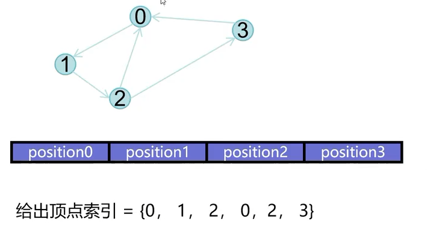

给定一组顶点数据，再给一个用哪些顶点的数据结构，就可以描述出一个图形

同一组顶点数据，用不同的索引描述，也可以画出不同的图形

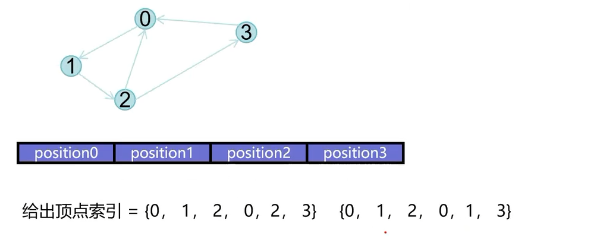

我们来算一下用不用ebo情况下，占用的空间大小

不用ebo：6个顶点，一个顶点有位置和color，6个数字；那么一共就消耗144字节

用ebo：4个顶点，一个顶点有位置和color，6个数字；还有6个索引数字；一共消耗120字节

可以发现，这只是位置和颜色，如果再加上纹理、法线等数据，使用顶点索引会大量节省数据

在顺便说一下，如果只有位置数据，那么引入ebo会导致总数居更大，不划算；但是现实中，不可能只有位置数据

#### EBO的创建和使用

EBO也是一块显存区域，和vbo的创建很像

```c++
std::vector<unsigned int> eleIndex = {
    0, 1, 2,
    1, 2, 3
};
unsigned int ebo = 0;
glGenBuffers(1, &ebo);
glBindBuffer(GL_ELEMENT_ARRAY_BUFFER, ebo);
glBufferData(GL_ELEMENT_ARRAY_BUFFER, eleIndex.size() * sizeof(float), eleIndex.data(), GL_STATIC_DRAW);
```

可以发现，其实就是`GL_ELEMENT_ARRAY_BUFFER`这个参数和vbo不一样

ebo的绑定：ebo绑定的时候，需要当前存在绑定的vao，表示当前ebo与vao关联

```c++
glBindVertexArray(vao); // 先绑定vao或者让vao已经处于绑定状态
glBindBuffer(GL_ELEMENT_ARRAY_BUFFER, ebo);
```

不仅绑定时有顺序，解绑时也有严格限制：

千万不要在 VAO 处于活动状态（已绑定）时，去解绑 EBO（即调用 `glBindBuffer(GL_ELEMENT_ARRAY_BUFFER, 0)`）！

```c++
glBindVertexArray(0);
glBindBuffer(GL_ELEMENT_ARRAY_BUFFER, 0);
```

#### EBO绘制

使用ebo绘制就不再是用`glDrawArrays`了而是`glDrawElements`

```c++
void glDrawElements(
    GLenum mode,        // 图元绘制模式
    GLsizei count,      // 索引数量
    GLenum type,        // 索引数据类型
    const void *indices // 索引偏移量
);
```

- mode: 绘制模式，`GL_TRIANGLES`、`GL_LINES`
- count: 索引数量
- type: 索引类型，一般是`unsigned int`
- indices: 偏移量，从索引数组的第几个索引开始。直接指向索引数组的指针（现代 OpenGL 已弃用此方式，必须使用 EBO）

### 绘制矩形

参考代码：[01.6.Rect-ebo](01.6.Rect-ebo/)

### 封装Shader和Color

在代码中会用到Shader，总是硬编码也不方便，因此需要封装一个shader类，管理shader program

同时，为了方便，assets文件夹也会copy到程序二进制目录和执行目录

```cmake

# 复制到二进制文件目录
add_custom_command(TARGET ${PROJECT_NAME} POST_BUILD
    COMMAND ${CMAKE_COMMAND} -E copy_directory
        ${PROJECT_SOURCE_DIR}/assets $<TARGET_FILE_DIR:${PROJECT_NAME}>/assets
    COMMENT "Syncing assets to output directory"
)

# 复制到二进制文件目录的上层目录，实际为执行目录
add_custom_command(TARGET ${PROJECT_NAME} POST_BUILD
    COMMAND ${CMAKE_COMMAND} -E copy_directory
        ${PROJECT_SOURCE_DIR}/assets $<TARGET_FILE_DIR:${PROJECT_NAME}>/../assets
    COMMENT "Syncing assets to output directory"
)

```

另外，总是用红绿蓝配色不好看，为了方便管理颜色，可以封装一个Color类，方便对颜色操作

封装的工具都在 [00.utils](00.utils/) 目录下，作为静态库存在

### glsl语法、数据类型、向量操作

#### glsl基础

到目前为止，我们关于着色器，只是用了基本内容

详细一点的内容可以看 [着色器基础](docs/02.GLSL-Basic.md)

顶点着色器和片段着色器都可以承接上一个步骤的计算或者属性输入

代码里的glVertexAttribPointer index参数就是顶点着色器里的location

顶点着色器可以声明输出，然后传递给片段着色器

```glsl
// 顶点着色器里面
out vec3 color;

// 片段着色器
in vec3 color
```

变量名必须一致

在之前，着色器里面，都是写死`layout (location = 0) in vec3 aPos`，对应的代码也是写死index参数

但是也可以不用location变量，可以动态获取属性编号

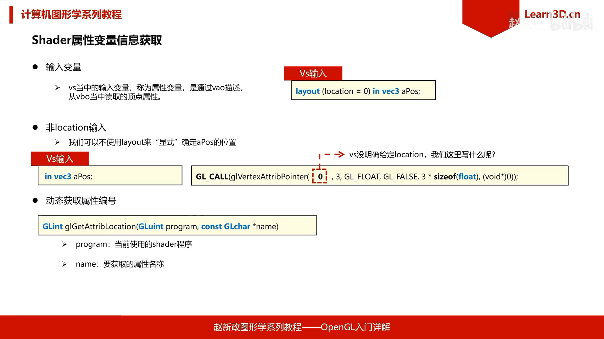

使用glsl动态获取属性编号的示例可以看 [动态获取属性编号](01.09.Rect-glsl/)

#### Uniform变量

Shader在执行运算的时候，彼此之间的数据不共享，但是指令一致

uniform相当于一个全局变量，且可以通过C/C++程序传递给着色器程序

uniform操作方法

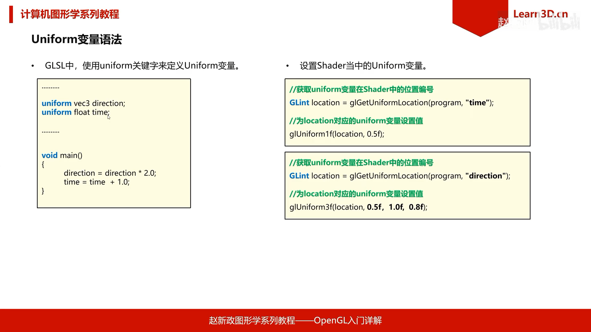

uniform变量定义

```glsl
uniform vec3 direction;
uniform float timeVal;
```

uniform变量传递

```c++
int location = glGetUniformLocation(programId_, name.c_str());
glUniform1f(location, value);
```

可以比较容易看出来

```c++
glUniform1f(); //对应uniform float xxx;
glUniform3f(); //对应uniform vec3 xxx;
```

### 纹理

在之前的绘制中，我们可以给每个顶点设置颜色，控制顶点的颜色，顶点之间则是通过**插值**自动计算颜色

实际模型里的颜色可能非常丰富，这不是给几个顶点配置颜色，然后gpu自动插值能做到的

但是我们不可能使用与像素数量一致的顶点去绘制图形，因为每个模型都会需求更多的顶点，每个顶点又需求一个颜色属性。

于是，开发者们就想到，可以用现有的图片给贴到图形上，这个图片就叫做**纹理**（Texture）。

图片可以做的非常精细，即使只有少数顶点，也可以绘制丰富的图形颜色和细节。

比如LearnOpengl上的，给三角形贴上一张砖墙的示例：


就像示例里面那样，只有三个顶点，但是图形内部的颜色细节很丰富。

此时有个疑问，图片都是矩形的，怎么把矩形的图片贴到三角形的图形上呢？

他们大小不同，形状不同，坐标系都不一样，该怎么处理呢？

这是我们就需要引入UV坐标

#### UV坐标

先不看UV坐标的定义，先想一想为什么要引入UV坐标呢？还有前面的问题该怎么解决呢？

给一个200x250的图形，再给一个200x250的图片，二者大小一致，此时将图片贴到图形上，只需一个一个像素一对一贴过去就可以了

现在图片不变，图形变为了300x250，无法一一对应了，该怎么办。

我们可以尝试将**像素对应**改为**比例对应**，可以允许重复一些像素

以前：使用图片第x行，第y行的像素

现在：使用图片横向u%，纵向v%位置的像素

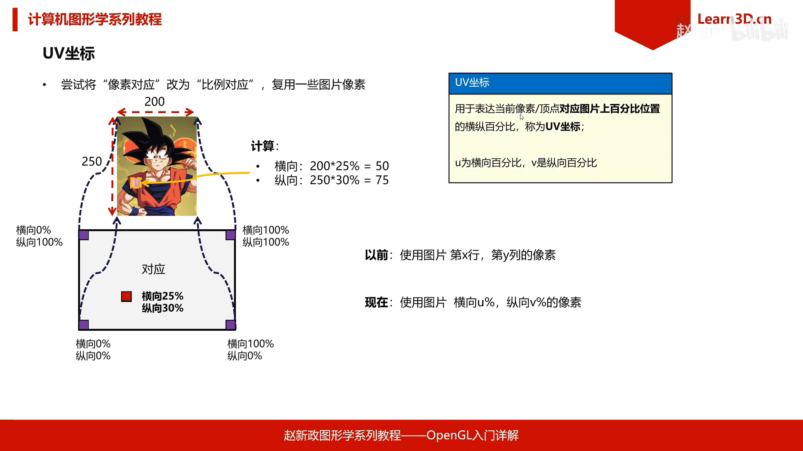

可以类比opengl的NDC坐标，把现实世界映射到了[-1, 1]区间。uv坐标也是一样，将图形和图片各自映射到了[0, 1]区间

现在知道了uv坐标的含义，该怎么用呢

uv坐标完全由你指定，你想把哪个点定为u0 v0，哪个点定位u1 v1都可以

如果简单一点的话，以三角形为例，找到它的包络矩形，将最左下角定义为u0v0，最右上角定义为u1v1

你还可以将包络矩形的中间定义为u1v1，那么这个三角形就可能会超过u1v1，这是允许的，此时我们就需要规定超过u1v1范围后的行为。后面再说

对于图片来说，本身就是矩形，那么最左下角就是u0v0，最右上角就是u1v1

#### 纹理与采样

纹理对象（Texture）：在GPU端，用来以一定格式存放纹理图片描述信息与数据信息的对象

采样器（Sampler）：在GPU端，用来根据UV坐标，以一定算法，从纹理图片中获取颜色的过程为采样，执行采样对象成为采样器

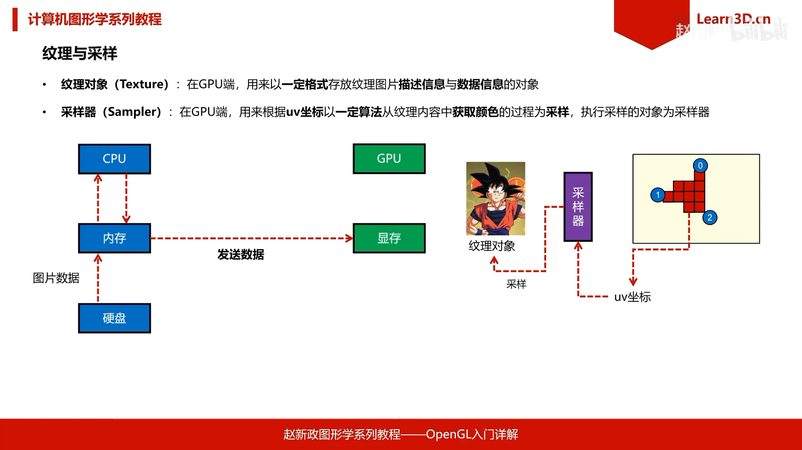

我们在定义了各个顶点的uv坐标后，然后经历了光栅化，此时每个像素都有了自己的uv坐标，跟颜色一样，中间像素的uv坐标也是顶点插值出来的

那么采样器就可以拿着每个像素的uv坐标，到纹理对象里面找像素

#### 图片操作API

读取图片，使用stbImage库，地址在 [https://github.com/nothings/stb](https://github.com/nothings/stb)

`stb_image` 是一个非常流行的单头文件库，用于加载多种格式的图片文件（如 PNG, JPG, BMP, TGA 等）。

使用 `git submodule` 将 `stb_image` 添加到 `00.3rd` 目录下：
```shell
git submodule add https://github.com/nothings/stb.git 00.3rd/stb
```

在项目中使用 `stb_image` 时，通常只需要包含头文件并定义宏。

```cpp
#define STB_IMAGE_IMPLEMENTATION
#include "stb_image.h"
```

注意：上面的哪个宏必须定义，否则会编译不过


1. **加载图片到内存**
   `stbi_load(const char *filename, int *out_width, int *out_height, int *out_channels, void **out_data)`
   - `filename`: 图片文件的路径。
   - `out_width`: 输出的图片宽度。
   - `out_height`: 输出的图片高度。
   - `out_channels`: 输出的颜色通道数（通常是 3 或 4）。
   - `out_data`: 指向图像数据的指针。加载完成后，需要手动使用 `stbi_image_free` 释放内存。

2. **从文件加载图片**
   `stbi_load_from_file(const char *filename, int *out_width, int *out_height, int *out_channels, int stride, int scale_x, int scale_y, void **out_data)`
   - 增加了 `stride`（步长）、`scale_x`、`scale_y` 参数，支持更复杂的加载需求。

3. **垂直翻转**
   `stbi_set_flip_vertically_on_load(bool flip)`
   - 由于 OpenGL 的纹理坐标系（左下角为原点）与大多数图片格式（左上角为原点）不同，通常需要调用此函数将图像垂直翻转。

4. **释放内存**
   `stbi_image_free(void *data)`
   - 释放由 `stbi_load` 分配的内存。


关于opengl坐标系和图片坐标系的区别

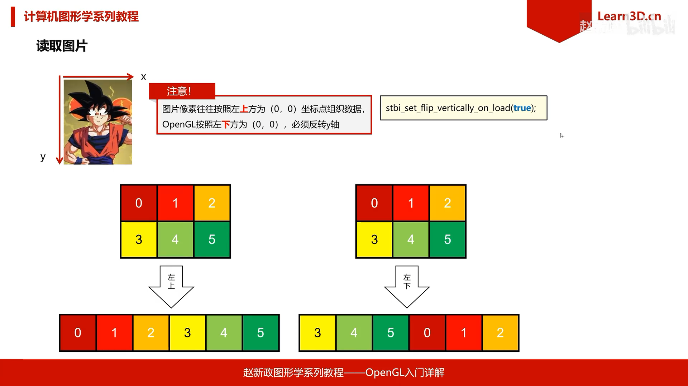

示例代码

```cpp
int width, height, channels;
unsigned char *data = stbi_load("assets/image.png", &width, &height, &channels, 0);
if (data) {
    // 使用数据进行操作...
    stbi_image_free(data);
}
```

#### 纹理操作API

纹理单元 (Texture Unit)

纹理单元是 GPU 上的一个硬件槽位，用于将纹理对象（Texture）与采样器（Sampler）关联起来。

在 OpenGL 中，着色器中的 `sampler2D`（或其他采样器类型）并不直接指向具体的纹理对象，而是指向一个**纹理单元**。这意味着你可以动态地在不同的纹理单元中切换不同的纹理，而无需重新编译着色器。

核心概念：

- **绑定过程**：首先通过 `glActiveTexture(GL_TEXTURE0 + i)` 激活特定的纹理单元（i 为单元编号）。
- **关联对象**：然后调用 `glBindTexture(GL_TEXTURE_2D, textureId)`。此时，该纹理对象就被绑定到了当前的活跃纹理单元上。
- **采样过程**：在 GLSL 中，采样器变量（如 `uniform sampler2D myTexture;`）的值实际上就是纹理单元的编号（如 0, 1, 2...）。

示例代码：

```cpp
// 激活 0 号纹理单元并绑定纹理
glActiveTexture(GL_TEXTURE0);
glBindTexture(GL_TEXTURE_2D, textureId1);

// 激活 1 号纹理单元并绑定另一个纹理
glActiveTexture(GL_TEXTURE1);
glBindTexture(GL_TEXTURE_2D, textureId2);
```

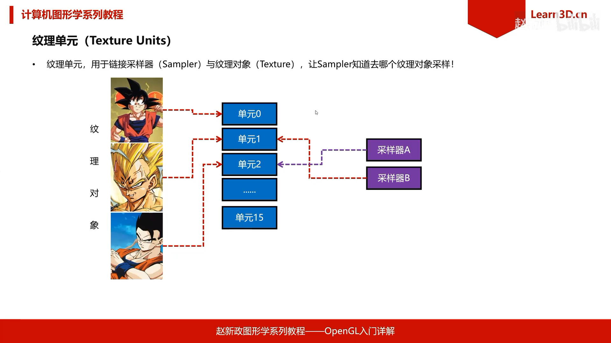

纹理对象操作接口

纹理对象（Texture Object）是 GPU 端用于存储纹理数据和相关属性的对象。


```cpp
void glGenTextures(GLsizei n, GLuint* textures);
void glBindTexture(GLenum target, GLuint texture);
```

- n: 创建多少个纹理
- textures: 创建出来的纹理 ID 列表的首地址
- target: 纹理的目标类型（如 `GL_TEXTURE_2D`）
- texture: 纹理的 ID

例如：

```cpp
unsigned int texture;
glGenTextures(1, &texture);
glBindTexture(GL_TEXTURE_2D, texture);
```

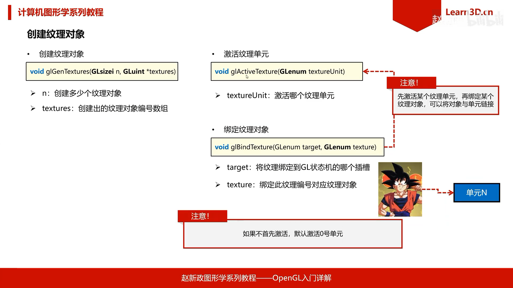

传输纹理数据

将数据从内存（CPU端）传输到显存（GPU端）最常用的接口是 `glTexImage2D`。

```cpp
void glTexImage2D(GLenum target, GLint level, GLint internalFormat, GLsizei width, GLsizei height, GLint border, GLenum format, GLenum type, const void * data);
```

- `target`: 纹理目标（如 `GL_TEXTURE_2D`）
- `level`: 纹理Mipmap层级（通常为 0）
- `internalFormat`: GPU内部存储格式（如 `GL_RGB`, `GL_RGBA`）
- `width`: 纹理宽度
- `height`: 纹理高度
- `border`: 边框宽度（通常为 0）
- `format`: 数据格式（如 `GL_RGB`, `GL_RGBA`）
- `type`: 数据类型（如 `GL_UNSIGNED_BYTE`）
- `data`: 指向图像数据的指针

此外，我们还需要设置纹理的过滤和混合参数，使用 `glTexParameteri`：

```cpp
void glTexParameteri(GLenum target, GLenum parameter, GLint value);
```

- `parameter`: 想要设置的参数。常用的包括：
  - `GL_TEXTURE_MIN_FILTER`: 最小化过滤（如 `GL_LINEAR`, `GL_NEAREST`）
  - `GL_TEXTURE_MAG_FILTER`: 最大化过滤
  - `GL_TEXTURE_WRAP_S`: S方向（水平）的重复模式（如 `GL_REPEAT`, `GL_CLAMP_TO_EDGE`）
  - `GL_TEXTURE_WRAP_T`: T方向（垂直）的重复模式

示例：

```cpp
glBindTexture(GL_TEXTURE_2D, texture);
glTexImage2D(GL_TEXTURE_2D, 0, GL_RGB, width, height, 0, GL_RGB, GL_UNSIGNED_BYTE, data);
glTexParameteri(GL_TEXTURE_2D, GL_TEXTURE_MIN_FILTER, GL_LINEAR);
glTexParameteri(GL_TEXTURE_2D, GL_TEXTURE_MAG_FILTER, GL_LINEAR);
glTexParameteri(GL_TEXTURE_2D, GL_TEXTURE_WRAP_S, GL_REPEAT);
glTexParameteri(GL_TEXTURE_2D, GL_TEXTURE_WRAP_T, GL_REPEAT);
```

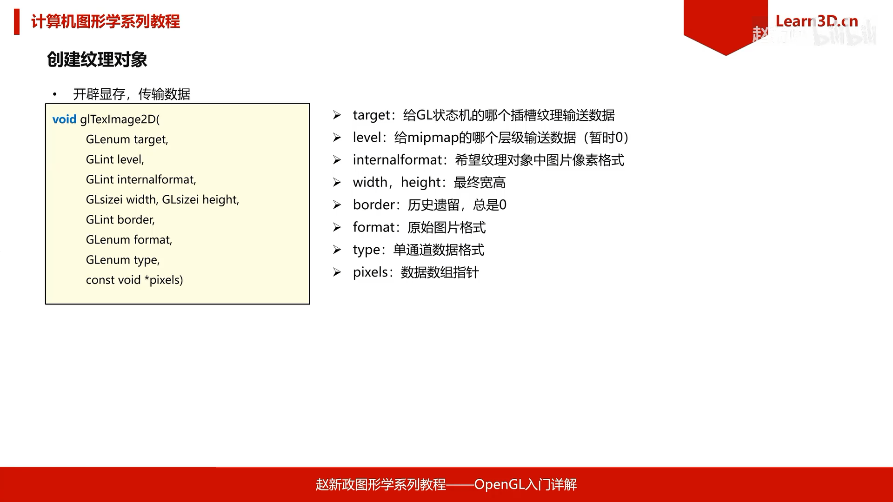

总结

准备一个纹理对象的流程如下示例：

```c++
void MainWindow::PrepareTexture()
{
    // 读取图片
    int width = 0;
    int height = 0;
    int channels = 0;
    // 反转y轴，OpenGL的纹理坐标系原点在左下角，而图片的原点在左上角
    stbi_set_flip_vertically_on_load(true);
    auto* imgPtr = stbi_load("assets/image/wall.jpg", &width, &height, &channels, STBI_rgb_alpha);

    unsigned int textureId = 0;
    glGenTextures(1, &textureId);

    glActiveTexture(GL_TEXTURE0); // 如果不激活，默认激活0，gpu至少保证有16个纹理单元
    glBindTexture(GL_TEXTURE_2D, textureId); // 把纹理绑定到当前激活的纹理单元上

    // 传输图片输入（描述+内容）
    glTexImage2D(GL_TEXTURE_2D, 0, GL_RGBA, width, height, 0, GL_RGBA, GL_UNSIGNED_BYTE, imgPtr);
    // 释放图片内存
    stbi_image_free(imgPtr);
    imgPtr = nullptr;

    glTexParameteri(GL_TEXTURE_2D, GL_TEXTURE_WRAP_S, GL_REPEAT); // 设置纹理环绕方式：水平重复
    glTexParameteri(GL_TEXTURE_2D, GL_TEXTURE_WRAP_T, GL_REPEAT); // 设置纹理环绕方式：垂直重复
    glTexParameteri(GL_TEXTURE_2D, GL_TEXTURE_MIN_FILTER, GL_LINEAR); // 设置纹理缩小过滤：线性过滤

}
```

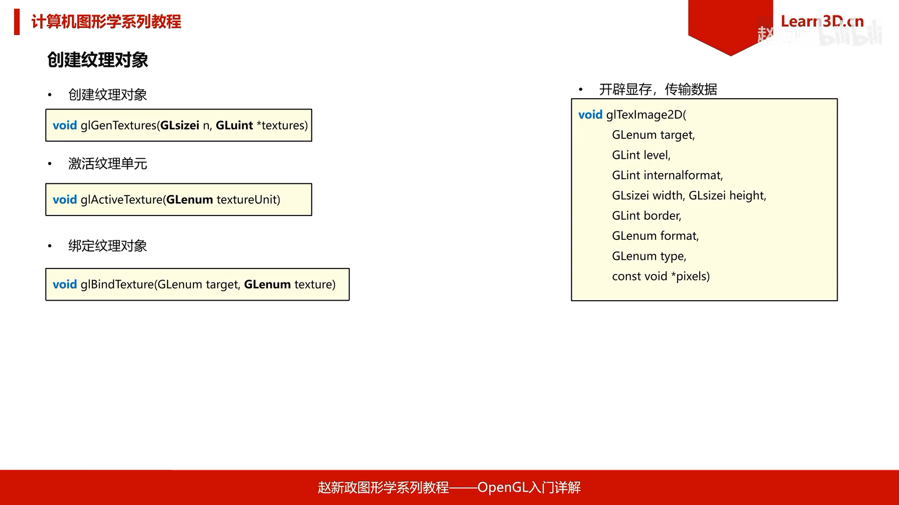

到目前位置，我们一直在讲纹理本身，UV坐标去哪里了？

UV坐标是顶点属性，需要像设置位置和颜色那样，给顶点设置UV坐标

UV坐标完全是由你指定的，你想设置多少就设置多少

并不是要把图形边缘正好和图片边缘对齐

你可以把UV坐标定义的很小，也可以把UV坐标定义的很大，来让纹理只显示一部分或者完全在图形内部显示

代码可以参考 [01.11.Texture](01.11.Texture/)

#### 纹理示例

给一个矩形贴图 [01.12.Texture-rect](01.12.Texture-rect/)

尝试不同的包裹方式 [01.13.Texture-wrap](01.13.Texture-wrap/)

通过动态改变uv值，实现轮播图效果 [01.14.Texture-dynamic](01.14.Texture-dynamic/)


