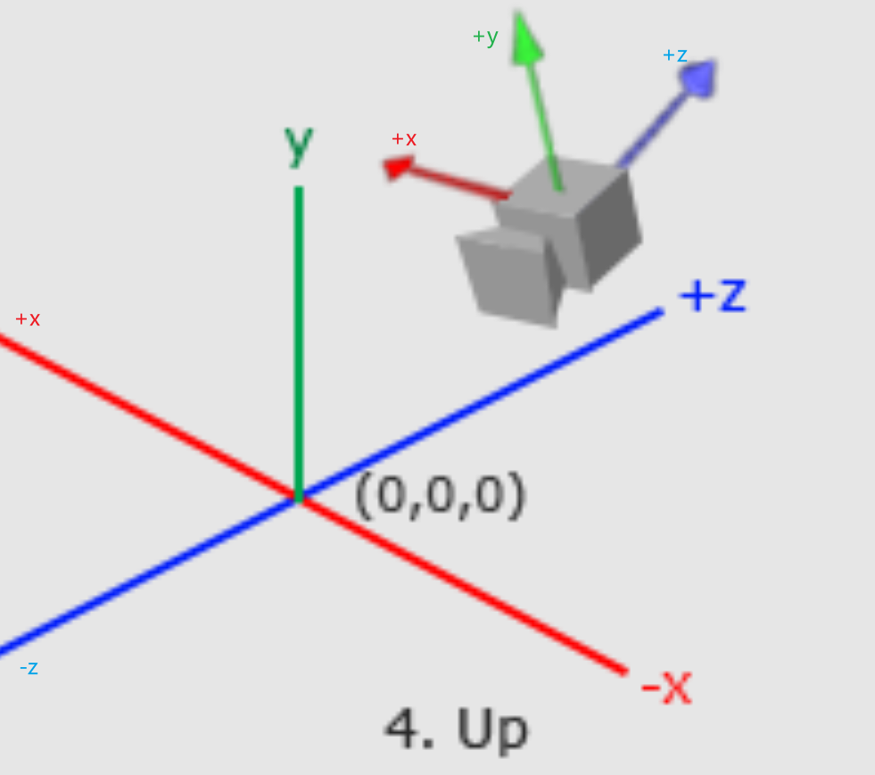

# 进入3D

## 变换与四元数

可以先看一下LearnOpenGL [变换](https://learnopengl-cn.github.io/01%20Getting%20started/07%20Transformations/)

四元数仅能表示纯旋转。其数学形式为$q = (w, x, y, z)$，其中w是标量分量，$(x, y, z)$是向量分量。四元数通过单位四元数$\left \| q \right \| = 1$，唯一确定一个3D旋转。

其次坐标4x4变换矩阵，可以完整的表示仿射变换，平移、旋转、缩放、剪切等

四元数的一般表示形式

$$
q = w + x\mathbf{i} + y\mathbf{j} + z\mathbf{k}
$$

这里需要注意，i, j, k 是虚数，代表的是三个坐标轴的方向，我们实际上关心的是他们的系数

设旋转角为θ，单位旋转轴向量为$u = (u_{x}, u_{y}, u_{z})$，那么对应的单位四元数定义为：

$$
q = \cos (\frac{\theta }{2}) + \sin (\frac{\theta }{2}) (u_{x}\mathbf{i} + u_{y}\mathbf{j} + u_{z}\mathbf{k})
$$

即：

- 标量分量 $w = \cos (\frac{\theta }{2})$
- 向量分量 $(x, y, z) = \sin (\frac{\theta }{2}) \cdot \mathbf{u}$

四元数$q = (w, x, y, z)$对应的旋转矩阵为

$$
R(q)=\left[\begin{array}{ccc}
1-2 y^{2}-2 z^{2} & 2 x y-2 z w & 2 x z+2 y w \\
2 x y+2 z w & 1-2 x^{2}-2 z^{2} & 2 y z-2 x w \\
2 x z-2 y w & 2 y z+2 x w & 1-2 x^{2}-2 y^{2}
\end{array}\right]
$$

其中w,x,y,z已经包含了旋转角度θ和旋转轴u，无需显示记录θ

如果用4维变换矩阵表示任意轴$(R_{x}, R_{y}, R_{z})$旋转，则是下面这个样子

$$
\begin{bmatrix}\cos\theta+R_x{}^2(1-\cos\theta)&R_xR_y(1-\cos\theta)-R_z\sin\theta&R_xR_z(1-\cos\theta)+R_y\sin\theta&0\\R_yR_x(1-\cos\theta)+R_z\sin\theta&\cos\theta+R_y^2(1-\cos\theta)&R_yR_z(1-\cos\theta)-R_x\sin\theta&0\\R_zR_x(1-\cos\theta)-R_y\sin\theta&R_zR_y(1-\cos\theta)+R_x\sin\theta&\cos\theta+{R_z}^2(1-\cos\theta)&0\\0&0&0&1\end{bmatrix}
$$

四元数的变换矩阵和4维变换矩阵的左上角子矩阵，是等价的

四元数：仅用4个浮点数（ w,x,y,z ）就能完整记录一个物体的旋转姿态。由于其数值紧凑且在组合旋转、插值（SLERP）时具有极高的稳定性和效率，它被广泛用作内部状态的存储格式

因此，在实际工作流中，引擎会在CPU端使用四元数处理复杂的逻辑和动画，然后在提交给GPU前，将单位四元数转换为3×3旋转矩阵，并将其嵌入到4×4齐次变换矩阵的左上角位置

可以这样理解：四元数是“高效、稳定的旋转数据压缩包”，而4×4矩阵左上角的3×3子矩阵是“解压后供GPU直接使用的旋转指令”。两者的核心旋转信息是完全等价的，只是前者更适合人类和CPU去运算与维护，后者则是底层硬件执行仿射变换的标准格式。

最终四元数还是会转换为矩阵，然后和其他缩放、平移、仿射等变换合并为一个4维变换矩阵，传递给GPU

## 摄像机

### 相机空间

先去看LearnOpengl [摄像机](https://learnopengl-cn.github.io/01%20Getting%20started/09%20Camera/)

可以知道，一个摄像机，本质上就是一个view矩阵，一个摄像机类，最重要的功能就是返回一个view矩阵

这个view（视图）矩阵，就可以将世界以及世界里的物体，变换到这个视图矩阵的坐标系下

这个视图矩阵，代表着我们以什么姿态看向世界，就想象有一个摄像机在世界里移动，可以从任何位置，以任何角度，看向目标点；也就是说，这个视图矩阵的**摄像机坐标系**相对于世界坐标是有偏移以及倾斜的

就像下图这样


假设这时，给定世界坐标系和相机坐标系，就像上图那样，我们可以想象一下这个相机是怎么放到这个位置的

如果一开始相机就是个普通的物体放在世界中心，相机坐标系和世界坐标系重叠；那么此时从相机的视角观察世界，就是普普通通的世界，没有任何变换/变化；

现在考虑换个视角看世界，那么就要挪动相机；以世界为参考系，过程是：

1. 相机本体就和普通物体一样，绕世界坐标系旋转
2. 在以世界坐标系为参考平移到相机位置

那么站在相机的视角，以相机坐标系为参考系，过程就变为了

1. 将整个世界延相机位置相反的方向平移
2. 再根据相机坐标系进行旋转，旋转的是整个世界

也就是教程里面，lookAt矩阵（视图矩阵）里面平移是在后面的原因；这个矩阵返回出去，会被乘到顶点坐标，也就是将顶点先平移，再旋转

$$
\text { LookAt }=\left[\begin{array}{cccc}
R_{x} & R_{y} & R_{z} & 0 \\
U_{x} & U_{y} & U_{z} & 0 \\
D_{x} & D_{y} & D_{z} & 0 \\
0 & 0 & 0 & 1
\end{array}\right] *\left[\begin{array}{cccc}
1 & 0 & 0 & -P_{x} \\
0 & 1 & 0 & -P_{y} \\
0 & 0 & 1 & -P_{z} \\
0 & 0 & 0 & 1
\end{array}\right]
$$

这里，我们一定要正确地认识到 OpenGL 中“摄像机”的本质：摄像机本身是不动的，我们是通过反向移动整个世界来模拟摄像机的运动。

为了方便，我们想象出一个相机，在世界里动来动去，看向世界；但是实际上哪有什么实际存在的相机

所有的操作都是针对顶点的变换，也就是对“世界”的变换

移动的不是相机，而是“世界”

这里还得补充一下，初始状态，相机坐标系与世界坐标系重叠，也就是什么都不做，这个时候我们仍然能看到世界和世界里的物体（就像一句废话），我们应该意识到，相机镜头朝向，是和相机坐标系的+z是反过来的，也就是相机看向的方向是相机坐标系的-z

或者说，世界天然就是朝向屏幕的，天然朝向相机镜头的，实际这个镜头并不存在



继续看这个矩阵

$$
\left[\begin{array}{cccc}
R_{x} & R_{y} & R_{z} & 0 \\
U_{x} & U_{y} & U_{z} & 0 \\
D_{x} & D_{y} & D_{z} & 0 \\
0 & 0 & 0 & 1
\end{array}\right]
$$

教程里说，R是右向量，U是上向量，D是方向向量；也就是相机坐标系的xyz轴单位向量；三者相互垂直，构成一个坐标系；

我们现在抛开lookAt的平移矩阵，只看这个相机坐标系构成的矩阵

这个相机坐标系就是原点与世界原点重合的一个坐标系，相当于将世界绕某个轴旋转一定角度，得到这个坐标系

那么这个矩阵，就是一个绕任意轴旋转的旋转矩阵；做的其实是旋转操作

教程里有这样一段话“把这个LookAt矩阵作为观察矩阵可以很高效地把所有世界坐标变换到刚刚定义的观察空间”。结合之前所说的，把世界先平移到相机位置的反方向，再用相机坐标系当作旋转矩阵去旋转，就能得到我们预期的世界物体摆放

平移很好弄，直接把相机位置取反就可以了

相机在空间中，可能以任意姿态摆放（旋转），这个旋转矩阵不好求，尤其是找旋转轴，再找旋转角度，很不好计算

但是，我们可以直接计算相机的坐标系，这样这个坐标系矩阵，就是世界的旋转矩阵，注意这里不是相机本身的旋转矩阵；相机本身的旋转矩阵是坐标系矩阵的逆矩阵；这一点在四元数相机里会用到

这里补充一点线性代数知识点

> 一个3×3的旋转矩阵，其列向量（或行向量，取决于存储方式）恰恰就是变换后坐标系的三个基向量（X轴、Y轴、Z轴）。


> 对于任何标准的旋转矩阵𝑅（正交矩阵），它有一个极其重要的性质：它的逆矩阵等于它的转置矩阵。

那么现在，我们就可以开始构造相机的坐标系了

第一步，需要知道相机位置

```c++
glm::vec3 cameraPos = glm::vec3(0.0f, 0.0f, 3.0f);
```

第二步，需要知道相机看向的目标点

```c++
glm::vec3 cameraTarget = glm::vec3(0.0f, 0.0f, 0.0f);
```

第三步，求出相机方向，还有**方向向量**（z轴）

```c++
glm::vec3 cameraFront = glm::normalize(cameraTarget - cameraPos);
glm::vec3 cameraDirection = glm::normalize(cameraPos - cameraTarget);
```

这里的相机方向比较符合直觉，就是看向的方向；这里的方向向量，和相机方向相反，其实就是相机坐标系的+z轴方向

第四步，求出x轴，也就是右轴

这里需要随便找一个向上的向量，不一定和z轴垂直，叉乘就可以得到和z轴垂直且向右的向量

```c++
glm::vec3 up = glm::vec3(0.0f, 1.0f, 0.0f);
glm::vec3 cameraRight = glm::normalize(glm::cross(up, cameraDirection));
```

这里一般用世界的y轴正方向，那么万一相机的z轴和世界的y重叠了怎么办，此时就是奇点，这时可以求出无穷个右轴；如果遇到了这种情况，up就不能再用世界的y了，取决于你希望这个相机的右朝向哪里，可以取世界的-z等其他向量作为参考

第五步，求出y轴，也就是上轴，上向量

已经有了x，z，二者直接叉乘就是y

```c++
glm::vec3 cameraUp = glm::cross(cameraDirection, cameraRight);
```

GLM已经提供了这些支持。我们要做的只是定义一个摄像机位置，一个目标位置和一个表示世界空间中的上向量的向量（我们计算右向量使用的那个上向量）。接着GLM就会创建一个LookAt矩阵，我们可以把它当作我们的观察矩阵：

```c++
glm::mat4 view;
view = glm::lookAt(glm::vec3(0.0f, 0.0f, 3.0f),
           glm::vec3(0.0f, 0.0f, 0.0f),
           glm::vec3(0.0f, 1.0f, 0.0f));
```

还有一些处理移动什么的，就不展开了，可以看下面的代码

[相机基础](../02.05.3D-camera/)

[相机输入处理](../02.06.3D-camera-input/)

### 欧拉角

前面就已经提到了相机会有姿态变换，包括移动和旋转，移动很简单，这个旋转就是指**视角变换**

欧拉角就是一个可以表示空间中任何一个3D旋转状态的工具

我们看完教程，应该已经可以知道，按照给定欧拉角顺序变换，**中间**哪个变换如果为正负90度，那么就会产生万向节死锁，死锁原因可以查阅其他资料

一般来说，符合人直觉的变换顺序是：偏航角（yaw）、俯仰角（pitch）、滚转角（Roll）

教程中给定的代码决定了变换顺序，如果变换顺序不一样，那么代码也不是下面这样

```c++
direction.x = cos(glm::radians(pitch)) * cos(glm::radians(yaw)); // 译注：direction代表摄像机的前轴(Front)，这个前轴是和本文第一幅图片的第二个摄像机的方向向量是相反的
direction.y = sin(glm::radians(pitch));
direction.z = cos(glm::radians(pitch)) * sin(glm::radians(yaw));
```

教程里面给的是图形化推导，很好理解；基本上可以理解为，先旋转的角会受后旋转角的影响

或者就简单矩阵乘就可以了

Pitch (俯仰角) - 绕 X 轴旋转

$$
R_x(\text{pitch}) = \begin{bmatrix}
1 & 0 & 0 \\
0 & \cos(\text{pitch}) & -\sin(\text{pitch}) \\
0 & \sin(\text{pitch}) & \cos(\text{pitch})
\end{bmatrix}
$$

Yaw (偏航角) - 绕 Y 轴旋转

$$
R_y(\text{yaw}) = \begin{bmatrix}
\cos(\text{yaw}) & 0 & \sin(\text{yaw}) \\
0 & 1 & 0 \\
-\sin(\text{yaw}) & 0 & \cos(\text{yaw})
\end{bmatrix}
$$

Roll (翻滚角) - 绕 Z 轴旋转

$$
R_z(\text{roll}) = \begin{bmatrix}
\cos(\text{roll}) & -\sin(\text{roll}) & 0 \\
\sin(\text{roll}) & \cos(\text{roll}) & 0 \\
0 & 0 & 1
\end{bmatrix}
$$

实际推导可能和实际矩阵乘不一致，教程网站里面，顺时针是角度正方向，所以当角度为0时，指向x正方向，要想指向z轴负方向，需要-90度

实现代码可以参考 [欧拉角相机](../02.08.3D-camera-utils/)

### 四元数

前面以及讲了四元数的基础概念，四元数相机的构造需要记录四个系数w,x,y,z

这个四个系数就决定了唯一的一个四元数

```c++
glm::quat orientation_ { 1.0f, 0.0f, 0.0f, 0.0f }; // w, x, y, z
```

初始状态就是上面定义的那样，表示什么都不做，默认指向z轴负方向

那么当需要转换视角时，怎么构造新的对应的四元数呢

这个时候我们还得用欧拉角作为工具，或者借用欧拉角的思想

需要认识到，欧拉角在变换的时候会有万向节死锁的情况，但是不变换，只描述状态的情况下，一组欧拉角可以表示三位空间的任意一个朝向状态

而且鼠标输入，用户输入，也是用“绕某个轴旋转多少度”描述的

四元数虽不依赖欧拉角，用欧拉角可以方便的描述物体状态，以及处理鼠标输入】

这里严格意义不能叫欧拉角，应该叫绕轴旋转角度，yaw/pitch/roll分别表示绕y/x/z轴旋转的角度

绕y轴旋转0度时，指向z轴负方向；欧拉角的yaw偏航角为0度时则是指向x轴正方向
三个变量可以改名为angleY/angleX/angleZ，分别表示绕y/x/z轴旋转的角度

一组欧拉角，可以描述任意三维空间的任意状态，但是变换的时候容易引发万向节死锁问题

而四元数没有这个问题，四元数可以按任意顺序，任意角度，组合**累加**变换，没有任何奇点问题

也就是说，我们可以把欧拉角的三个角度，每个角度单独转为一个四元素，然后将这些四元数累加变换，就可以实现任意顺序，任意角度变换

旋转必须考虑增量旋转，当姿态变换之后，再进行变换，是在上一次变换的基础上做旋转

因此，每次变换，相机的本身坐标系都已经发生了变化。每次计算旋转时，都要基于新的**上向量**、**右向量**做变换


```c++
void QuateCamera::UpdateOrientationFromIncrement(float yawOffset, float pitchOffset)
{
    glm::mat3 rotationMatrix = glm::mat3_cast(orientation_);
    // 1. 创建绕Y轴（Yaw）的增量旋转四元数
    // 注意：glm::angleAxis 接受的是弧度
    glm::vec3 localUp = rotationMatrix * glm::vec3(0.0f, 1.0f, 0.0f); // 相机的局部上向量
    glm::quat qYawIncrement = glm::angleAxis(glm::radians(yawOffset), localUp);

    // 2. 创建绕X轴（Pitch）的增量旋转四元数
    // 获取当前相机局部右向量
    glm::vec3 localRight = rotationMatrix * glm::vec3(1, 0, 0);
    glm::quat qPitchIncrement = glm::angleAxis(glm::radians(pitchOffset), localRight);

    // 3. 组合增量旋转
    // 顺序很重要。通常先处理Yaw（左右看），再处理Pitch（上下看）。
    // 这意味着 qPitchIncrement 是在 qYawIncrement 旋转后的坐标系中进行的。
    glm::quat qIncrement = qPitchIncrement * qYawIncrement;

    // 4. 将增量旋转应用到当前朝向
    // 新的朝向 = 增量旋转 * 当前朝向
    orientation_ = qIncrement * orientation_;

    // 5. 归一化，防止浮点数误差累积
    orientation_ = glm::normalize(orientation_);

    // 6. (可选) 俯仰角限制
    // 增量旋转本身不会自动限制俯仰角，如果需要限制，需要更复杂的逻辑，
    // 例如：将当前四元数转回欧拉角，检查并修正pitch，再转回四元数。
    // 为了保持纯粹的增量旋转，这里暂时省略此步骤。
}
```

这样，就可以在用户改变朝向时，先改变欧拉角，再构造四元数

再来看看view矩阵构造

前面我们提到过相机的本质：

换个视角看世界，那么就要挪动相机；以世界为参考系，过程是：

1. 相机本体就和普通物体一样，绕世界坐标系旋转
2. 在以世界坐标系为参考平移到相机位置

那么站在相机的视角，以相机坐标系为参考系，过程就变为了

1. 将整个世界延相机位置相反的方向平移
2. 再根据相机坐标系进行旋转，旋转的是整个世界

具体代码就是

```c++
glm::mat4 QuateCamera::GetViewMatrix() const
{
    // 使用四元数的共轭（逆）作为视图的旋转部分
    glm::mat4 rotationMatrix = glm::mat4_cast(glm::conjugate(orientation_));
    // 平移矩阵：将世界反向平移到相机位置
    glm::mat4 translationMatrix = glm::translate(glm::mat4(1.0f), -position_);
    // 视图矩阵 = 逆旋转 * 平移
    glm::mat4 view = rotationMatrix * translationMatrix;

    return view;
}
```

由于是反过程/逆过程，因此旋转矩阵是逆矩阵，平移矩阵也是取负数

代码可以参考 [四元数相机](../02.09.3D-camera-quat/)

## Mesh类

到目前位置，我们都还在直接使用vao vbo，只有着色器和纹理封装了类，到绘制立方体时，各种顶点和属性配置已经很复杂了，vao vbo也可以封装一个类了

学到现在，我们应该可以发现，一个vao可以最终代表一个图形，因此我们的封装也是以vao为核心封装

头文件

```c++
#pragma once

#include <glad/gl.h>
#include <vector>

class Mesh {
public:
    Mesh();
    ~Mesh();

    Mesh(const Mesh&) = delete;
    Mesh& operator=(const Mesh&) = delete;
    Mesh(Mesh&& other) noexcept;
    Mesh& operator=(Mesh&& other) noexcept;

    void AddVertexBuffer(const std::vector<float>& data, GLenum usage = GL_STATIC_DRAW);

    void AddVertexAttribute(unsigned int location, int size, GLenum type,
        GLboolean normalized, GLsizei stride, const void* offset);

    void SetIndexBuffer(const std::vector<unsigned int>& indices, GLenum usage = GL_STATIC_DRAW);

    void Bind() const;
    void Unbind() const;

    void Draw(GLenum mode = GL_TRIANGLES) const;

    unsigned int GetIndexCount() const { return indexCount_; }

private:
    void Destroy();

    unsigned int vao_ { 0 };
    std::vector<unsigned int> vbos_;
    unsigned int ebo_ { 0 };

    unsigned int indexCount_ { 0 };
};
```

源文件

```c++
#include "Mesh.h"
#include <iostream>

Mesh::Mesh()
{
    glGenVertexArrays(1, &vao_);
}

Mesh::~Mesh()
{
    Destroy();
}

Mesh::Mesh(Mesh&& other) noexcept
    : vao_(other.vao_)
    , vbos_(std::move(other.vbos_))
    , ebo_(other.ebo_)
    , indexCount_(other.indexCount_)
{
    other.vao_ = 0;
    other.ebo_ = 0;
    other.indexCount_ = 0;
}

Mesh& Mesh::operator=(Mesh&& other) noexcept
{
    if (this != &other) {
        Destroy();
        vao_ = other.vao_;
        vbos_ = std::move(other.vbos_);
        ebo_ = other.ebo_;
        indexCount_ = other.indexCount_;
        other.vao_ = 0;
        other.ebo_ = 0;
        other.indexCount_ = 0;
    }
    return *this;
}

void Mesh::Destroy()
{
    if (vao_ != 0) {
        glDeleteVertexArrays(1, &vao_);
        vao_ = 0;
    }

    for (unsigned int vbo : vbos_) {
        glDeleteBuffers(1, &vbo);
    }
    vbos_.clear();

    if (ebo_ != 0) {
        glDeleteBuffers(1, &ebo_);
        ebo_ = 0;
    }

    indexCount_ = 0;
}

void Mesh::AddVertexBuffer(const std::vector<float>& data, GLenum usage)
{
    if (data.empty()) {
        std::cerr << "[Mesh] Vertex buffer data is empty" << std::endl;
        return;
    }

    unsigned int vbo;
    glGenBuffers(1, &vbo);
    glBindVertexArray(vao_);
    glBindBuffer(GL_ARRAY_BUFFER, vbo);
    glBufferData(GL_ARRAY_BUFFER, data.size() * sizeof(float), data.data(), usage);
    glBindBuffer(GL_ARRAY_BUFFER, 0);
    glBindVertexArray(0);

    vbos_.push_back(vbo);
}

void Mesh::AddVertexAttribute(unsigned int location, int size, GLenum type,
    GLboolean normalized, GLsizei stride, const void* offset)
{
    if (vbos_.empty()) {
        std::cerr << "[Mesh] No vertex buffer added before adding attribute" << std::endl;
        return;
    }

    unsigned int lastVbo = vbos_.back();
    glBindVertexArray(vao_);
    glBindBuffer(GL_ARRAY_BUFFER, lastVbo);
    glVertexAttribPointer(location, size, type, normalized, stride, offset);
    glEnableVertexAttribArray(location);
    glBindBuffer(GL_ARRAY_BUFFER, 0);
    glBindVertexArray(0);
}

void Mesh::SetIndexBuffer(const std::vector<unsigned int>& indices, GLenum usage)
{
    if (indices.empty()) {
        std::cerr << "[Mesh] Index buffer data is empty" << std::endl;
        return;
    }

    if (ebo_ != 0) {
        glDeleteBuffers(1, &ebo_);
    }

    glGenBuffers(1, &ebo_);
    glBindVertexArray(vao_);
    glBindBuffer(GL_ELEMENT_ARRAY_BUFFER, ebo_);
    glBufferData(GL_ELEMENT_ARRAY_BUFFER, indices.size() * sizeof(unsigned int), indices.data(), usage);
    glBindVertexArray(0);
    glBindBuffer(GL_ELEMENT_ARRAY_BUFFER, 0);

    indexCount_ = static_cast<unsigned int>(indices.size());
}

void Mesh::Bind() const
{
    glBindVertexArray(vao_);
}

void Mesh::Unbind() const
{
    glBindVertexArray(0);
}

void Mesh::Draw(GLenum mode) const
{
    if (vao_ == 0) {
        std::cerr << "[Mesh] VAO not initialized" << std::endl;
        return;
    }

    if (ebo_ == 0) {
        std::cerr << "[Mesh] Index buffer not set (EBO required)" << std::endl;
        return;
    }

    glBindVertexArray(vao_);
    glDrawElements(mode, static_cast<GLsizei>(indexCount_), GL_UNSIGNED_INT, nullptr);
    glBindVertexArray(0);
}
```

## Scene和Transform类

Transform负责将模型放入世界，也就是生成Model matrix

Scene负责持有一组Mesh/Camera/Shader/Texture，可以代表一次渲染所需的资源

做这些封装是因为代码越来越复杂，封装之后会有利于后面的学习

代码参考：[Scene](../02.11.3D-Scene/)

## 引入imgui

我没学过Imgui，借助AI引入了imgui

现在涉及到的参数会越来越多，有了imgui就可以通过UI调整参数，不用每次都重新编译

代码参考：[Imgui](../02.12.3D-Imgui/)

